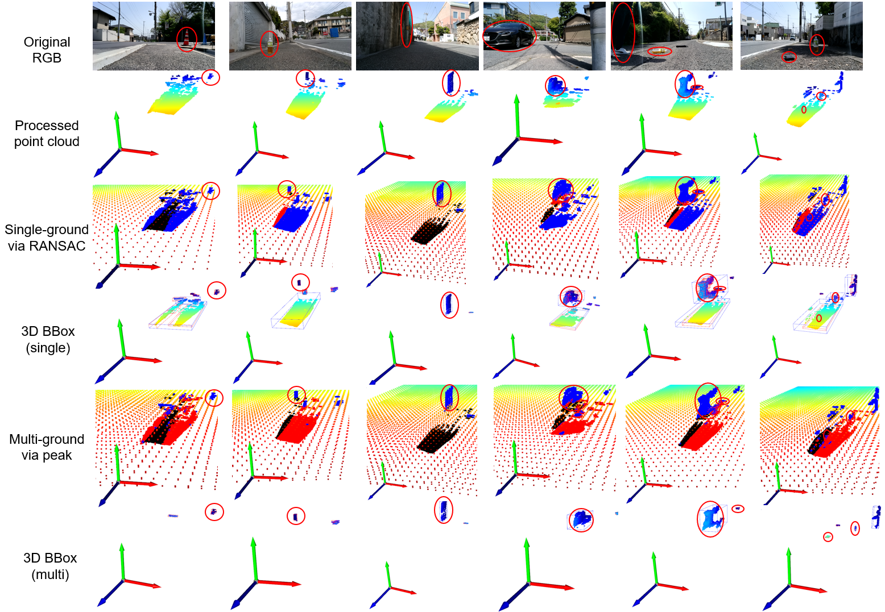

# ObstacleDetectionViaStereoVision
This paper [PPC-US-LSF3DOD: A Pseudo-Point-Clouds based Unsupervised and Scalable Late-Sensor-Fusion Method for 3D Obstacle Detection](https://ieeexplore.ieee.org/abstract/document/10328989) has been accpeted by IEEE International Conference on Robotics and Computer Vision (ICRCV 2023).

To get the 3D coordinates and sizes of multi-scale obstacles (3D Obstacle Detection), we propose an unsupervised and scalable late sensor fusion method using pseudo point clouds obtained from a stereo camera [Luxonis OAK-D](https://shop.luxonis.com/products/oak-d) mounted on our mobility scooter.


In order to obtain high-quality depth maps and point clouds, we first perform various preprocessing and postprocessing on them, such as Speckle filter, probabilistic denoising, etc. Then we propose a multi-scale method for the problem of different ground heights (idea 1) and different scales of point cloud clustering (idea 2).


In addition, we also utilize an RGB monocular camera aligned with a stereo camera for late sensor fusion, which enables partially unlabeled point cloud obstacles to be assigned to a category. Our experimental results show that the proposed system achieves superior results on mobility scooters and electric wheelchairs without requiring a lot of computing resources and equipment costs.


# Usage
We use this python SDK [DepthAI Python](https://github.com/luxonis/depthai-python) to read the grayscale images (left & right) and the RGB image from the stereo camera in real time.

## Dependencies 
```
depthai # https://github.com/luxonis/depthai-python/tree/main/examples/install_requirements.py
python=3.8
cudatoolkit=11.3
pytorch==1.12.1
torchvision==0.13.1
pandas
numpy
scipy
cv2
open3d
k3d
sklearn
scikit-image
scikit-learn
mayavi
```

# Tutorial
```
obstacle_detection.ipynb
```

# Demo 
```
rgb_disparity_alignment.py
```

# Visualization of results

